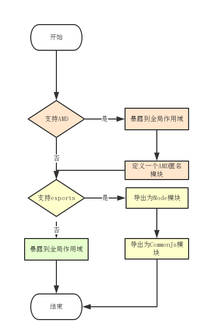

# lodash代码结构

## 模块化
新版本是使用es6语法编写代码的，直接使用了import/export进行模块化。
以深拷贝cloneDeep为例：
```
import baseClone from './.internal/baseClone.js'
function cloneDeep(value) {
//code
}
export default cloneDeep
```
而以往的第三方库使用立即执行函数来实现模块化的，lodash源码经过[lodash-cli](https://github.com/lodash-archive/lodash-cli)打包后同样如此。
```
(function(){
  //content
}.call(this))
```
这样做实际上就一个目的：**降低复杂度**

主要体现在这几个方面：
1. 对代码进行封装，隐藏了某个功能实际的细节，从而对外只暴露API，不会污染全局作用域。
还是以cloneDeep为例，它对于使用者来说隐藏了深拷贝的细节，我们只需要知道执行cloneDeep(obj)这段代码就会给我们一个obj的深拷贝对象。

2. 使得代码紧凑和正交。这样可以使得程序的每一个部分只考虑解决一个定义明确的问题而不会说会让代码互相影响。比如说cloneDeep它只负责深拷贝，不会说还会返回你一个过滤了cap:"green"键值对的对象。

## 全局挂载对象_
\_对象原来是用来标识underscore全局对象的，但是lodash是基于underscore的库，所以为了减少使用者的学习成本和迎合使用习惯，同样也是用lodash来作为挂载各种工具方法的全局对象。

不过，新版lodash本身源码并没有_对象，这个挂载的过程交给了lodash-cli去完成。这样，使用者可以根据自己的需要灵活定制打包出来的lodash。

其实，无论是什么情况，\_都是引用了代码中的lodash对象，然后根据情况采用不同的模块规范暴露出去：


那么这个lodash对象怎么来的呢？其实它是一个函数。为什么会被设计成一个函数对象呢？当然是方便链式调用了，这个后期会叙述。
```
function lodash(value) {
	return value instanceof LodashWrapper ? value : new LodashWrapper(value);
}
```
这个函数同时也是一个对象，所以它才是最初的载体。从这个lodash中我们能发现一个很重要的构造函数：LodashWrapper
```
function LodashWrapper(value, chainAll) {
	this.__wrapped__ = value;
	this.__actions__ = [];
	this.__chain__ = !!chainAll;
}

```
LodashWrapper做了什么事情呢？它把一个正常的js数据包装成一个抽象数据结构，这个ADT由\_\_wrapped\_\_(被包装者)、\_\_actions\_\_(行为)、\_\_chain\_\_(支持链)组成，从而让此lodash包装对象拥有内聚的、明确的职责。

最后，将各种方法挂载到lodash对象或原型上去：
```
//直接挂载示例
lodash.assignIn = assignIn;
lodash.before = before;
lodash.bind = bind;
lodash.chain = chain;

//原型挂载示例
mixin(lodash, lodash);

lodash.prototype.toJSON = lodash.prototype.valueOf = lodash.prototype.value = wrapperValue;
```
这样就得到了我们最终的lodash对象，至于挂载的细节我将会在编程范式那里叙述。

### 兼容其他_
当有\_对象冲突问题时怎么办？比如同时引入underscore和lodash时的\_的时候。这时候的关键在一个函数身上：noConflict
```
//用例：var lodash = _.noConflict();
var oldDash = root._;
function noConflict() {
	if (root._ === this) {
	  root._ = oldDash;
	}
	return this;
}
```
我们发现\_对象的控制权被交给了另一个对象，当前的this(也就是lodash对象)作为函数返回值返回，用例中使用一个新的lodash变量去引用它，这样_和lodash就可以兼容了。

## 执行环境判断
为了在nodejs环境下和浏览器环境下都可以正常使用，lodash会对执行环境进行判断，从而把_对象挂载到全局作用域上去。

```
/** 是否是Node环境 */
var freeGlobal = typeof global == 'object' && global && global.Object === Object && global;

/** 是否是浏览器环境 */
var freeSelf = typeof self == 'object' && self && self.Object === Object && self;

/** 全局对象 */
var root = freeGlobal || freeSelf || Function('return this')();

/** 是否支持export */
var freeExports = typeof exports == 'object' && exports && !exports.nodeType && exports;

/** 是否支持module */
var freeModule = freeExports && typeof module == 'object' && module && !module.nodeType && module;

```
这里在判断浏览器环境的时候目标是self对象而不是window，是因为self在不具有窗口的上下文环境中比如Web Worker中也是适用的。
## 层次划分
lodash的代码层次很简洁：只是分为内部函数和公共函数层。

内部函数的注释中会有一个@private标记，并且没有用例，顾名思义就是私有函数。公共函数就是平时大家用到的那些函数，比如chain/sortBy/groupBy等。


