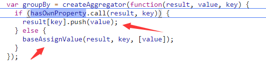
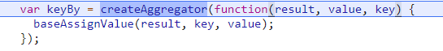
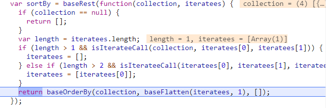
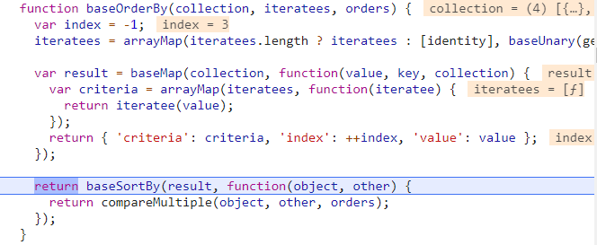
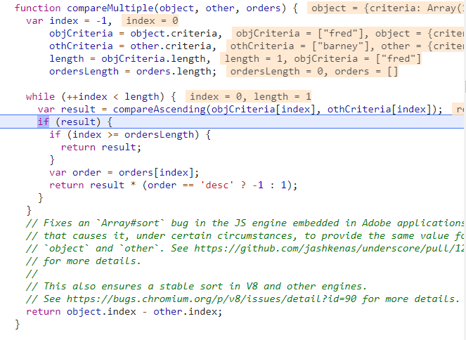

## 集合仿SQL API系列
lodash很有趣，实现了一些类似sql语法的api，比如groupBy、keyBy、countBy、orderBy、sortBy
**full版本才实现**

### 辅助函数createAggregator
这类sql函数都是通过createAggregator来创建的：
```
function createAggregator(setter, initializer) {
  return function(collection, iteratee) {
    var func = isArray(collection) ? arrayAggregator : baseAggregator,
        accumulator = initializer ? initializer() : {};

    return func(collection, setter, getIteratee(iteratee, 2), accumulator);
  };
}
```
可以看出，setter就是传入的规则，它根据集合是数组还是对象分别创建一个arrayAggregator或baseAggregator函数，然后返回func调用结束的结果

#### arrayAggregator和baseAggregator
```
function arrayAggregator(array, setter, iteratee, accumulator) {
  var index = -1,
    length = array == null ? 0 : array.length;

  while (++index < length) {
    var value = array[index];
    setter(accumulator, value, iteratee(value), array);
  }
  return accumulator;
}

function baseAggregator(collection, setter, iteratee, accumulator) {
  baseEach(collection, function(value, key, collection) {
    setter(accumulator, value, iteratee(value), collection);
  });
  return accumulator;
}
```
可以看出，这两个函数都是做了同一件事：遍历集合执行setter函数，最后返回accumulator

所以这个createAggregator就是根据setter把key给创建出来，然后把原先的集合值分类填入各个key里去

### groupBy
看用例：其实就是个分组函数
```
_.groupBy([6.1, 4.2, 6.3], Math.floor);
// => { '4': [4.2], '6': [6.1, 6.3] }
 
// The `_.property` iteratee shorthand.
_.groupBy(['one', 'two', 'three'], 'length');
// => { '3': ['one', 'two'], '5': ['three'] }
```

看实现：

其实就是实现了一个哈希表数组，元素不在表里的时候开辟一块新的空间，在的话直接添加进去

### keyBy
看用例：其实就是个键版本的分组函数,它和groupBy最大的区别是它的值不会包装到数组里去
```
var array = [
  { 'dir': 'left', 'code': 97 },
  { 'dir': 'right', 'code': 100 }
];
 
_.keyBy(array, function(o) {
  return String.fromCharCode(o.code);
});
// => { 'a': { 'dir': 'left', 'code': 97 }, 'd': { 'dir': 'right', 'code': 100 } }
 
_.keyBy(array, 'dir');
// => { 'left': { 'dir': 'left', 'code': 97 }, 'right': { 'dir': 'right', 'code': 100 } }
```
看实现：

比groupBy还简单，因为只用回调返回的值当键

### countBy
看用例：计数分组函数
```
_.countBy([6.1, 4.2, 6.3], Math.floor);
// => { '4': 1, '6': 2 }
 
// The `_.property` iteratee shorthand.
_.countBy(['one', 'two', 'three'], 'length');
// => { '3': 2, '5': 1 }
```
这次的实现就直接贴代码了：
```
var countBy = createAggregator(function(result, value, key) {
  if (hasOwnProperty.call(result, key)) {
    ++result[key];
  } else {
    baseAssignValue(result, key, 1);
  }
});
```
可以看出它就是groupBy的变形，也是利用了一个哈希表，只不过它的哈希表储存的不是元素，而是元素的个数

### sortBy
看用例：排序分组函数
```
var users = [
  { 'user': 'fred',   'age': 48 },
  { 'user': 'barney', 'age': 36 },
  { 'user': 'fred',   'age': 40 },
  { 'user': 'barney', 'age': 34 }
];
 
_.sortBy(users, [function(o) { return o.user; }]);
// => objects for [['barney', 36], ['barney', 34], ['fred', 48], ['fred', 40]]
 
_.sortBy(users, ['user', 'age']);
// => objects for [['barney', 34], ['barney', 36], ['fred', 40], ['fred', 48]]
```
看实现的话，它和之前的三个函数略有不同，主要使用了baseRest和baseOrderBy来辅助:


这其中原因有二：
1. baseRest可以接收多个参数传入，类似es6的...运算符，这样sortBy的第二个参数就可以接收一个数组来实现排序逻辑了，比如用例的回调数组或者键名数组。这个函数的具体实现请见函数篇
2. baseOrderBy和baseSortBy是真正的排序函数：

它先映射生成了一个新的集合,如果是数组就返回iteratee计算后的值，是对象就返回value、索引index、排序标准criteria, 方便排序。

最后再通过baseSortBy对result排序：
```
function baseSortBy(array, comparer) {
  var length = array.length;

  array.sort(comparer);
  while (length--) {
    array[length] = array[length].value;
  }
  return array;
}
```
这个baseSortBy其实就是封装了一下原生的sort函数，并抛弃了辅助用的index和criteria

至于compareMultiple则是一个比较复杂的比较函数了:

它可以比较两个对象，并且支持升降序比，比较标准优先是criteria属性，其次是index属性

再来看看compareAscending函数：
```
function compareAscending(value, other) {
  if (value !== other) {
    var valIsDefined = value !== undefined,
      valIsNull = value === null,
      valIsReflexive = value === value,
      valIsSymbol = isSymbol(value);

    var othIsDefined = other !== undefined,
      othIsNull = other === null,
      othIsReflexive = other === other,
      othIsSymbol = isSymbol(other);

    if ((!othIsNull && !othIsSymbol && !valIsSymbol && value > other) ||
      (valIsSymbol && othIsDefined && othIsReflexive && !othIsNull && !othIsSymbol) ||
      (valIsNull && othIsDefined && othIsReflexive) ||
      (!valIsDefined && othIsReflexive) ||
      !valIsReflexive) {
      return 1;
    }
    if ((!valIsNull && !valIsSymbol && !othIsSymbol && value < other) ||
      (othIsSymbol && valIsDefined && valIsReflexive && !valIsNull && !valIsSymbol) ||
      (othIsNull && valIsDefined && valIsReflexive) ||
      (!othIsDefined && valIsReflexive) ||
      !othIsReflexive) {
      return -1;
    }
  }
  return 0;
}
```
它考虑的情况比较多(undefined、null、NaN、Symbol)，但只要相等，就返回0，value>other返回1，否则返回-1。

### orderBy
可选升降序排序分组函数
```
var users = [
  { 'user': 'fred',   'age': 48 },
  { 'user': 'barney', 'age': 34 },
  { 'user': 'fred',   'age': 40 },
  { 'user': 'barney', 'age': 36 }
];
 
// Sort by `user` in ascending order and by `age` in descending order.
_.orderBy(users, ['user', 'age'], ['asc', 'desc']);
// => objects for [['barney', 36], ['barney', 34], ['fred', 48], ['fred', 40]]
```
分析了sortBy的实现，我们可以大胆地推测，其实orderBy就是在调用compareMultiple的时候传入了升降序标志位，来看看吧：
```
function orderBy(collection, iteratees, orders, guard) {
  if (collection == null) {
    return [];
  }
  if (!isArray(iteratees)) {
    iteratees = iteratees == null ? [] : [iteratees];
  }
  orders = guard ? undefined : orders;
  if (!isArray(orders)) {
    orders = orders == null ? [] : [orders];
  }
  return baseOrderBy(collection, iteratees, orders);
}
```
果然是和sortBy大同小异~