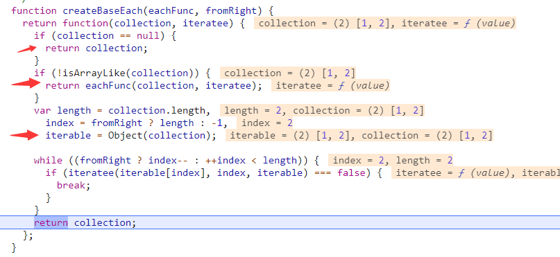
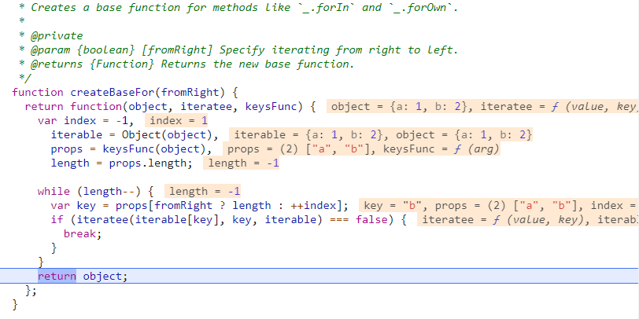
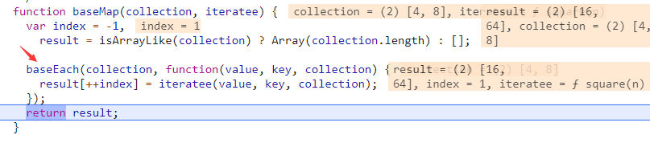
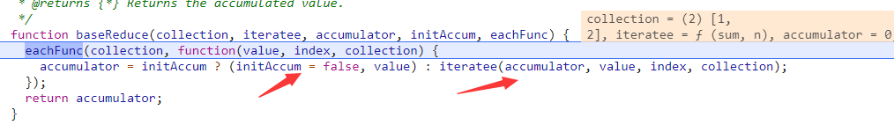

## 集合迭代系列
javascript自带的迭代方法如forEach、map等只支持数组的迭代，lodash对这些方法进行了改进，可以既对数组迭代，也可以对对象迭代，所以统称为集合迭代。

举个例子，\_.forEach的用例是这样的：
```
_.forEach([1, 2], function(value, index) {
  console.log(value);
});
// => Logs `1` then `2`.
 
_.forEach({ 'a': 1, 'b': 2 }, function(value, key) {
  console.log(key);
});
// => Logs 'a' then 'b' (iteration order is not guaranteed).
```
可以看出，其实数组的vaule-index是等同于对象的value-key，也就是说把数组的索引看做是一个对象的键也没毛病。
所以集合其实可以统一用键值对来表示。

下面让我们来看具体的实现

### forEach-baseEach

#### forEach实现
```
function forEach(collection, iteratee) {
	return baseEach(collection, baseIteratee(iteratee));
}
```
可以看出lodash对外暴露出的forEach方法事实上是调用了内部的baseEach和baseIteratee方法。baseIteratee我们前面介绍过了，它能够让迭代函数同时拥有遍历数组和对象的能力。

#### baseEach实现
```
var baseEach = createBaseEach(baseForOwn);
```
baseEach这里也很有趣，使用了createBaseEach和baseForOwn来生成函数，由此我可以有一个大胆的猜测，那就是createBaseEach肯定还生成了别的函数，一翻源码，果然在full版本的源码里发现了baseEachRight也是由createBaseEach生成的。

我们拿数组的那个用例给createBaseEach打个断点：

发现它根据collection的值建立了三条分支：
1. 为空直接返回
2. 不是类数组(也就是是个对象)调用eachFunc，也就是这个例子的baseForOwn
3. 是类数组的话开一个while循环调用iteratee函数，也就是我们传进去的迭代回调，参数也对应着值、索引、集合本身，这里会考虑调用结果为false时终止迭代，这一点是和js原生的each函数不一样的。

#### baseForOwn处理对象

让我们来看看baseForOwn的实现：
```
function baseForOwn(object, iteratee) {
  return object && baseFor(object, iteratee, keys);
}
var baseFor = createBaseFor();
```
我们这次换对象用例看看createBaseFor怎么运行的：

很明显，它和createBaseEach类似，只不过专门用来处理对象，也是开一个while循环调用iteratee函数，只是参数对应着是值、键、集合本身了

### map-baseMap
映射是函数式编程的基础函数之一，它所做的就是将各个元素逐个映射为新的元素。
官方的用例是这样的：
```
function square(n) {
  return n * n;
}
 
_.map([4, 8], square);
// => [16, 64]
 
_.map({ 'a': 4, 'b': 8 }, square);
// => [16, 64] (iteration order is not guaranteed)
 
var users = [
  { 'user': 'barney' },
  { 'user': 'fred' }
];
 
// The `_.property` iteratee shorthand.
_.map(users, 'user');
// => ['barney', 'fred']
```
#### map实现
```
function map(collection, iteratee) {
	return baseMap(collection, baseIteratee(iteratee));
}
```
是不是似曾相识？

#### baseMap实现
这次我们打个断点来看：

很明显baseMap是借用了baseEach实现的，这次都不需要自己判断是对象还是数组了，只需要初始化一个result数组用来存放每个被映射的元素就好了。

### baseFilter-filter
映射也是函数式编程不可或缺的一个方法

#### filter实现
function filter(collection, predicate) {
	return baseFilter(collection, baseIteratee(predicate));
}
仍旧是熟悉的味道，这不过这次iteratee换成了predicate

#### baseFilter实现

baseFilter比baseMap的实现简单，仍然是有一个result数组用来存放结果，只不过这次只存通过predicate检验的元素了。

### reduce-baseReduce
规约是函数式编程里比较难理解的一个概念，简单来说这就是一个由多至一的过程。

#### reduce实现
```
function reduce(collection, iteratee, accumulator) {
	return baseReduce(collection, baseIteratee(iteratee), accumulator, arguments.length < 3, baseEach);
}
```
我们发现比之前的forEach、map等实现多传了三个参数：accumulator, arguments.length < 3, baseEach，这有什么深刻的含义的呢？我们还是用官方用例打个断点看看：
```
_.reduce([1, 2], function(sum, n) {
  return sum + n;
}, 0);
// => 3
```

首先，accumulator对应着形参accumulator累加器、arguments.length < 3对应着initAccum是否有初始累加器、baseEach对应着eachFunc遍历函数。它们分别被用于：存储累加结果、存储累加器初始值、遍历当前集合。
我们再看遍历函数体有一个三元表达式，用来处理有初始累加值和没有的情况：如果没有初始值就拿集合的第一个值作为初始值。

### baseEvery和baseSome-every和some
剩下两个常见的就是every和some了

#### every和some实现
```
function every(collection, predicate, guard) {
	predicate = guard ? undefined : predicate;
	return baseEvery(collection, baseIteratee(predicate));
}
function some(collection, predicate, guard) {
	predicate = guard ? undefined : predicate;
	return baseSome(collection, baseIteratee(predicate));
}
```
两个函数其实和filter的实现非常相似，只不过多了一个guard的变量掺和

#### baseEvery和baseSome实现

```
function baseEvery(collection, predicate) {
	var result = true;
	baseEach(collection, function(value, index, collection) {
	  result = !!predicate(value, index, collection);
	  return result;
	});
	return result;
}

function baseSome(collection, predicate) {
	var result;

	baseEach(collection, function(value, index, collection) {
	  result = predicate(value, index, collection);
	  return !result;
	});
	return !!result;
}
```
可以发现，baseEvery就是开始置result为真，然后对每个元素调用predicate并返回给result，一旦result为false直接就结束了。而baseSome是先置result为undefined，然后返回的是!result，一旦result为true就结束了。

### reject-negate
在full版本里，还有一个reject函数，它是另一种filter，看看官方的用例：
```
var users = [
  { 'user': 'barney', 'age': 36, 'active': false },
  { 'user': 'fred',   'age': 40, 'active': true }
];
 
_.reject(users, { 'age': 40, 'active': true });
// => objects for ['barney']
```
#### reject实现
```
function reject(collection, predicate) {
  var func = isArray(collection) ? arrayFilter : baseFilter;
  return func(collection, negate(getIteratee(predicate, 3)));
}
```
可以看到这个函数的关键是使用了negate函数
#### negate实现
```
function negate(predicate) {
  if (typeof predicate != 'function') {
    throw new TypeError(FUNC_ERROR_TEXT);
  }
  return function() {
    var args = arguments;
    switch (args.length) {
      case 0:
        return !predicate.call(this);
      case 1:
        return !predicate.call(this, args[0]);
      case 2:
        return !predicate.call(this, args[0], args[1]);
      case 3:
        return !predicate.call(this, args[0], args[1], args[2]);
    }
    return !predicate.apply(this, args);
  };
}
```
可以看到，它在predicate调用完后对结果取了反。