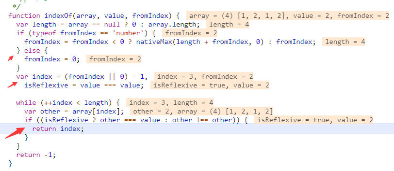
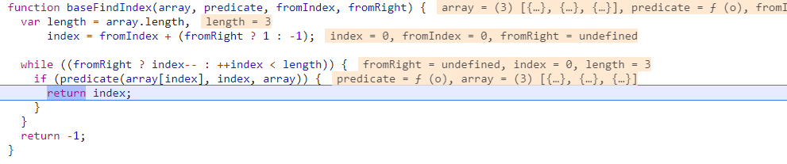
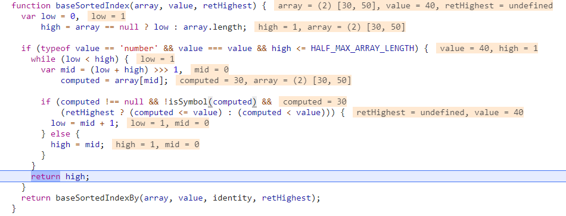
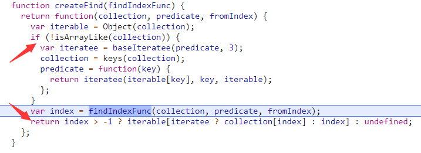

## 集合查询系列
我们平常对一个集合做的最多的事情就是增删改查了，而在这里面使用频率最高的又是查询。

### 查询位置
这类函数通常带个index或者key，比较有代表性的有：
1. indexOf和lastIndexOf 
2. findIndex和findLastIndex(findKey和findLastKey)
3. sortedIndex和sortedLastIndex(full版本)

#### indexOf和lastIndexOf
我们先用官方用例打个断点来看indexOf的实现：
```
// Search from the `fromIndex`.
_.indexOf([1, 2, 1, 2], 2, 2);
// => 3
```

我们可以看到它做了三件事情：
1. 获取数组长度
2. 获取起始查找点，这里如果fromIndex是负数的话需要转化成length + fromIndex
3. 返回符合条件元素的索引，这里有对一种特殊的Reflexive(自反)元素做处理，也就是NaN

lastIndexOf虽在只在full版本中才有，但实现细节是差不多的，唯一的区别就是把起始查找点设定成数组的结尾了。

#### findIndex和findLastIndex  
findIndex和infexOf的区别在于查询条件一个是函数一个是值。

finIndex的实现：
```
function findIndex(array, predicate, fromIndex) {
	var length = array == null ? 0 : array.length;
	if (!length) {
	  return -1;
	}
	var index = fromIndex == null ? 0 : toInteger(fromIndex);
	if (index < 0) {
	  index = nativeMax(length + index, 0);
	}
	return baseFindIndex(array, baseIteratee(predicate, 3), index);
}
```
还是做了三件事：
1. 获取数组长度
2. 获取起始查找点
3. 交给baseFindIndex去完成剩下的事情

让我们打个断点看baseFindIndex的细节：

它也是做了三件事：
1. 获取数组长度
2. 获取起始查找点
3. 返回符合predicate条件的元素索引

findLastIndex和findIndex的区别也是把起始查找点设定成数组的结尾罢了。

除此之外，查找对象的键的findKey和findLastKey的实现也是类似的
#### sortedIndex
有时候我们查找的是一个有序的数组，就可以用二分法等方法来优化查询速度

sortedIndex实现：
```
function sortedIndex(array, value) {
  return baseSortedIndex(array, value);
}
```
给baseSortedIndex打个断点：


可以看出，这里当value是数字时使用的是二分查询法。

### 查询元素
这类函数有find、findLast等

#### find
我们来看用例：
```
var users = [
  { 'user': 'barney',  'age': 36, 'active': true },
  { 'user': 'fred',    'age': 40, 'active': false },
  { 'user': 'pebbles', 'age': 1,  'active': true }
];
 
_.find(users, function(o) { return o.age < 40; });
// => object for 'barney'
```

```
var find = createFind(findIndex);
```
可以看出来find是由createFind生成的，甚至可以猜测findLast也是createFind生成的

createFind细节：

很明显，它根据两种情况返回不一样的值：
1. 非数组把predicate改造了，然后返回根据findIndex找到的键对应的元素
2. 数组返回根据findIndex找到的元素

#### findLast
它的实现和find形成了对称：
```
var findLast = createFind(findLastIndex);
```

### 查询元素是否存在
这类函数有includes等

#### includes(full版本)
这是个从集合中判断是否包含某个元素的方法，我们先来看用例：
```
_.includes([1, 2, 3], 1);
// => true
 
_.includes([1, 2, 3], 1, 2);
// => false
 
_.includes({ 'a': 1, 'b': 2 }, 1);
// => true
 
_.includes('abcd', 'bc');
// => true
```
也就是说它除了支持集合(数组和对象)，还支持字符串

让我们来看看它的实现：
```
function includes(collection, value, fromIndex, guard) {
  collection = isArrayLike(collection) ? collection : values(collection);
  fromIndex = (fromIndex && !guard) ? toInteger(fromIndex) : 0;

  var length = collection.length;
  if (fromIndex < 0) {
    fromIndex = nativeMax(length + fromIndex, 0);
  }
  return isString(collection) ? (fromIndex <= length && collection.indexOf(value, fromIndex) > -1) : (!!length && baseIndexOf(collection, value, fromIndex) > -1);
}
```
也就做了两件事：
1. 获取当前集合、搜索起始索引、长度
2. 如果是字符串，就借用indexOf获取结果。否则借用baseIndexOf获取结果

而baseIndexOf是这样的：
```
function baseIndexOf(array, value, fromIndex) {
	return value === value ? strictIndexOf(array, value, fromIndex) : baseFindIndex(array, baseIsNaN, fromIndex);
}
```
这里根据value是否是NaN再次做了分流处理，其实和我们开头看的findIndex实现原理是一样的。