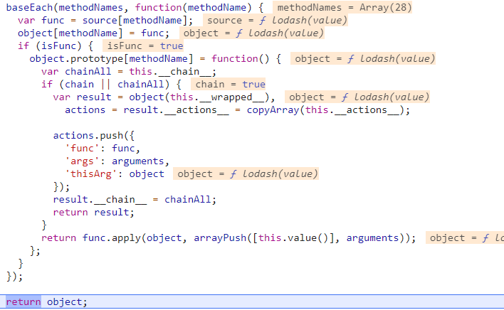

# lodash中的原型编程思想

## 原型编程简介
原型编程本来是JS的最初的编程范式，核心就在于对象间建立委托关系，形成一个有序的线性关系。

lodash虽然主要是以函数式编程为特点，但避免不了地也要使用JS原本的原型链编程思想。

## 原型链
既然说到原型就不得不说到原型链，这是组织对象的一种方法，不同于继承的派生对象(即is关系)，原型链上的对象是平等的独立个体。

根据这一点，实际上JS的对象都是靠原型链关联而不是类的派生来实现对象的，因为new其实是语法糖。
ES5提供了一个语法糖：Object.create，它的简单polyfill如下：
```
if (typeof Object.create !== "function") {
    Object.create = function (proto, propertiesObject) {
        var temp = new Object();
        temp.__proto__ = proto;
        if(typeof propertiesObject ==="object")
            Object.defineProperties(temp,propertiesObject);
        return temp;
    };
}

```
可以看出它实际上内部是创建了一个临时对象，然后把这个临时对象的原型链关联到某个原型上去。所以lodash中的baseCreate也使用了Object.create来创建一个对象。
```
var objectCreate = Object.create

var baseCreate = (function() {
function object() {}
	return function(proto) {
	  if (!isObject(proto)) {
	    return {};
	  }
	  if (objectCreate) {
	    return objectCreate(proto);
	  }
	  // 利用object这个函数，临时设置对象原型
	  object.prototype = proto;
	  // 创建一个对象，等价于result.__proto__ === prototype
	  var result = new object;
	  // 防止内存泄漏，因为闭包的原因，object常驻内存
	  object.prototype = undefined;
	  return result;
	};
}());
```
可以看出如果当前环境不支持Object.create的话lodash也会polyfill一个。

## 委托
很多lodash上的方法其实是委托JS原生API来做，例如Array.prototype、Object.prototype和String.prototype

```
var arrayProto = Array.prototype,
    objectProto = Object.prototype;

var hasOwnProperty = objectProto.hasOwnProperty;
var nativeObjectToString = objectProto.toString;
var propertyIsEnumerable = objectProto.propertyIsEnumerable;

// 批量委托
baseEach(['pop', 'join', 'replace', 'reverse', 'split', 'push', 'shift', 'sort', 'splice', 'unshift'], function(methodName) {
	//检测String.proto上是否有该函数
	var func = (/^(?:replace|split)$/.test(methodName) ? String.prototype : arrayProto)[methodName],
	//函数是否适用于tap拦截器
	chainName = /^(?:push|sort|unshift)$/.test(methodName) ? 'tap' : 'thru',
	//函数是否属于lodash未包装的
	retUnwrapped = /^(?:pop|join|replace|shift)$/.test(methodName);

	lodash.prototype[methodName] = function() {
	  var args = arguments;
	  //未包装且不支持链式调用的方法
	  if (retUnwrapped && !this.__chain__) {
	    var value = this.value();
	    return func.apply(isArray(value) ? value : [], args);
	  }
	  //支持链式调用的方法
	  return this[chainName](function(value) {
	    return func.apply(isArray(value) ? value : [], args);
	  });
	};
});
```
我们可以看出lodash主要是把它的一些方法委托给Object和Array的原型了。其中有一个一个委托的，也有批量委托的。

官方文档在_(value)下面说了这样一段话：
```
In addition to lodash methods, wrappers have Array and String methods.

The wrapper Array methods are:
concat, join, pop, push, shift, sort, splice, and unshift

The wrapper String methods are:
replace and split

The wrapper methods that support shortcut fusion are:
//省略

The chainable wrapper methods are:
//省略

The wrapper methods that are not chainable by default are:
//省略
```
什么意思呢？就是使用_()把一个非lodash对象，比如数组包装成lodash对象后，它拥有的若干方法是委托给Array和String的。

这里牵扯到一个chainName变量和一个value方法。

先来说chainName，它可能为两个值：tap或者thru(即through缩写)
```
function tap(value, interceptor) {
	interceptor(value);
	return value;
}

function thru(value, interceptor) {
	return interceptor(value);
}
```
我们可以观察到，这两个函数都是传入一个值和一个拦截器函数，只不过区别是在拦截器处理完这个值后，tap返回的是改变后的值，而thur返回拦截器函数的返回值。
举个官方例子：
```
_([1, 2, 3])
 .tap(function(array) {
// Mutate input array.
   array.pop();
 })
 .reverse()
 .value();
// => [2, 1]

_('  abc  ')
 .chain()
 .trim()
 .thru(function(value) {
   return [value];
 })
 .value();
// => ['abc']
```
所以实际上这两个函数的区别就在于tap适用于没有return的函数，thru适用于有return的函数。而pop、unshift、sort是直接改变数组的，所以它们适用于tap。

value方法是lodash原型上挂载的一个方法，用来返回被包装者的真正值。
```
lodash.prototype.value = wrapperValue;

function wrapperValue() {
	return baseWrapperValue(this.__wrapped__, this.__actions__);	
}

function baseWrapperValue(value, actions) {
	var result = value;
	return reduce(actions, function(result, action) {
	  return action.func.apply(action.thisArg, arrayPush([result], action.args));
	}, result);
}
```

终上所述，我们用一个例子下个断点记录一下完整的流程：
```
var test = _([1, 2, 3])
.tap(function(array) {
    array.pop();
})
.push(2)
.value();
// => [1,2,2]
```

可以看到，这个时候func对应的push其实就是Array.prototype.push

## 原型挂载
之前我们在1.1提过mixin的挂载功能，现在我们来详细分析一下。

让我们打个断点：
```
debugger
mixin(lodash, lodash)
```

可以看出，mixin先把object的键获取到，然后把source里对应这些键的方法名也获取到。

这里有一个判断：当只传了两个参数的时候，实际上是传了object是this，source是第一个参数，options是第二个参数。
```
if (options == null &&
//第二个参数不是对象或者另一种复杂情况
  !(isObject(source) && (methodNames.length || !props.length))) {
  options = source;
  source = object;
  object = this;
  methodNames = baseFunctions(source, keys(source));
}
```


然后开始遍历方法名，处理这些方法的\_\_chain\_\_、\_\_actions\_\_、\_\_wrapped\_\_，将这些方法挂载到object.prototype上，在我们这个例子中就是lodash.prototype上。

最后，返回这个mixin完毕的object。


